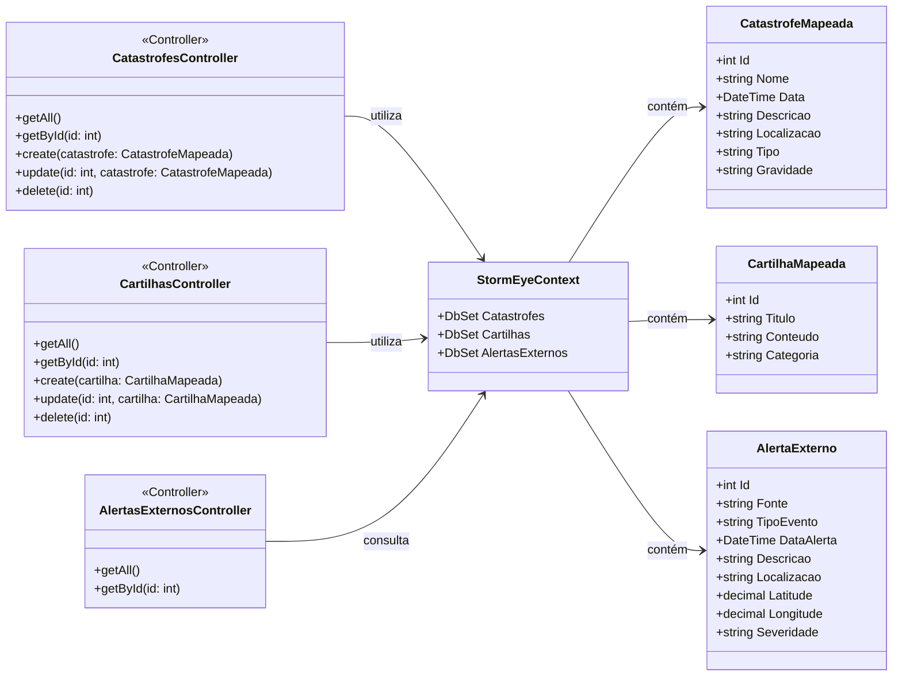

# StormEye

## Índice

- [Sobre o Projeto](#sobre-o-projeto)  
- [Funcionalidades](#funcionalidades)  
- [Arquitetura](#arquitetura)  
- [Diagrama de Classes](#diagrama-de-classes)  
- [Tecnologias Utilizadas](#tecnologias-utilizadas)  
- [Como Executar](#como-executar)  
  - [Pré-requisitos](#pré-requisitos)  
  - [Clonando o Repositório](#clonando-o-repositório)  
  - [Configuração](#configuração)  
  - [Executando a API](#executando-a-api)  
  - [Executando o Front-end](#executando-o-front-end)  
- [Endpoints da API](#endpoints-da-api)  
  - [Catástrofes](#catástrofes)  
  - [Cartilhas](#cartilhas)  
  - [Alertas Externos](#alertas-externos)  
- [Contribuição](#contribuição)  
- [Licença](#licença)  
- [Contato](#contato)  

---

## Sobre o Projeto

O **StormEye** é um sistema de monitoramento e gerenciamento de catástrofes naturais. Ele reúne informações sobre eventos extremos (como tempestades, terremotos, inundações etc.), disponibiliza cartilhas de prevenção e processa alertas externos provenientes de fontes como a API do GDACS (Global Disaster Alert and Coordination System). A aplicação é dividida em três camadas principais:

1. **StormEye.Domain**: Contém as entidades que representam o modelo de domínio (Catástrofe, Cartilha, Alerta Externo).  
2. **StormEye.Infrastructure**: Responsável pela persistência (Entity Framework Core) e integração com serviços externos (por exemplo, GDACS).  
3. **StormEyeApi**: Exposta como uma API RESTful em ASP.NET Core, agrupa os _controllers_ que lidam com Catástrofes, Cartilhas e Alertas Externos.  
4. **StormEyeWeb**: Projeto front-end (ASP.NET MVC ou SPA) que consome a API e apresenta uma interface para o usuário final.

O objetivo principal é oferecer uma visão consolidada de catástrofes em tempo real, além de materiais educativos (cartilhas) e alerts periódicos automatizados.

---

## Funcionalidades

- CRUD completo de **Catástrofes** (nome, data, descrição, localização, tipo, gravidade).  
- CRUD completo de **Cartilhas** (título, conteúdo, categoria).  
- Endpoints RESTful para consulta de todos os recursos (GET, POST, PUT, DELETE).  
- Interface web responsiva para consulta de catástrofes, leitura de cartilhas e visualização de alertas.  
- Contexto EF Core configurado para SQL Server (ou outro provedor configurável).  

---

## Arquitetura

```
StormEye.sln
│
├─ StormEye.Domain
│    ├─ Entidades:
│    │    ├─ CatastrofeMapeada.cs
│    │    ├─ CartilhaMapeada.cs
│    │    └─ AlertaExterno.cs
│    └─ (Outros agregados de domínio)
│
├─ StormEye.Infrastructure
│    ├─ Data:
│    │    └─ StormEyeContext.cs         ← DbContext configurado
│    ├─ Migrations/                     ← Migrations do EF Core
│    ├─ Service:
│    │    └─ GDACSService.cs            ← Integração com API GDACS
│    └─ (Repositórios, configurações de conexão, etc.)
│
├─ StormEyeApi
│    ├─ Controllers:
│    │    ├─ CatastrofesController.cs   ← CRUD de catástrofes
│    │    ├─ CartilhasController.cs     ← CRUD de cartilhas
│    │    └─ AlertasExternosController.cs← Processamento de alertas (e CRUD)
│    ├─ Program.cs                      ← Configuração de serviços, EF Core, CORS etc.
│    ├─ appsettings.json                ← String de conexão, chaves de API
│    └─ (Outros arquivos de configuração)
│
└─ StormEyeWeb
     ├─ Controllers (MVC ou API + Razor/SPA)
     ├─ Views / wwwroot (JS, CSS, HTML)
     └─ (Configurações de front-end)
```

- **Camada de Domínio (Domain)**  
  Contém apenas as classes que representam as tabelas do banco (CatastrofeMapeada, CartilhaMapeada, AlertaExterno) e eventuais _Value Objects_ ou _Enums_ relacionados.

- **Camada de Infraestrutura (Infrastructure)**  
  
- **API (StormEyeApi)**  
  Exposta em ASP.NET Core. Possui três _controllers_ principais:  
  - `CatastrofesController`: expõe endpoints para CRUD de catástrofes.  
  - `CartilhasController`: expõe endpoints para CRUD de cartilhas.  
  
- **Front-end (StormEyeWeb)**  
  Projeto que consome os mesmos endpoints da API, apresentando uma interface amigável para listar catástrofes, visualizar detalhes, ler cartilhas e acompanhar alertas recentes.

---

## Diagrama de Classes



    CatastrofesController --> StormEyeContext : utiliza
    CartilhasController --> StormEyeContext : utiliza
    AlertasExternosController --> GDACSService : utiliza
    AlertasExternosController --> StormEyeContext : consulta
```

---

## Tecnologias Utilizadas

- **.NET 9 / ASP.NET Core**
- **Entity Framework Core** (com Migrations e `StormEyeContext`)  
- **SQL Server** (ou qualquer outro banco suportado pelo EF Core)  
- **C# 11** (apenas como sugestão; adaptar conforme versões instaladas)  
- **Swagger / Swashbuckle** (para documentação e testes locais da API)  
- **JavaScript / Razor Pages / MVC** (no projeto StormEyeWeb)  
- **Dependências externas**:  
  - `Microsoft.EntityFrameworkCore`  
  - `Microsoft.EntityFrameworkCore.SqlServer` (ou outro provider)  
  - `Microsoft.Extensions.Hosting` (para Hosted Service de integração GDACS)  

---

## Como Executar

### Pré-requisitos

1. [.NET 9 SDK](https://dotnet.microsoft.com/pt-br/download/dotnet/9.0) (Uu versão compatível)  
2. [SQL Server](https://www.microsoft.com/pt-br/sql-server) (Local ou em nuvem)  
3. [Git](https://git-scm.com/downloads)  

### Clonando o Repositório

```bash
git clone https://github.com/AdonayRocha/StormEye.git
cd StormEye
```

### Configuração

1. No arquivo `appsettings.json` (localizado em **StormEyeApi**), ajuste a string de conexão para apontar para o seu servidor SQL. Por exemplo:

   ```jsonc
   {
     "ConnectionStrings": {
       "DefaultConnection": "Server=localhost;Database=StormEyeDb;User Id=sa;Password=SuaSenha123;"
     },
     "GDACS": {
       "ApiUrl": "https://www.gdacs.org/gdacsapi/api",
       "ApiKey": "SUA_CHAVE_GDACS"
     },
     "Logging": {
       "LogLevel": {
         "Default": "Information",
         "Microsoft.AspNetCore": "Warning"
       }
     },
     "AllowedHosts": "*"
   }
   ```

2. Opcionalmente, configure `appsettings.Development.json` para ambientes de desenvolvimento com parâmetros diferentes (portas, logging, etc.).

### Executando a API

1. Navegue até a pasta do projeto da API:

   ```bash
   cd StormEyeApi
   ```

2. Aplique as Migrations do Entity Framework (certifique-se de estar na pasta que contém o `StormEyeApi.csproj`):

   ```bash
   dotnet ef database update --project ../StormEye.Infrastructure/StormEye.Infrastructure.csproj --startup-project .
   ```

   Isso irá criar o banco de dados e as tabelas conforme as entidades do `StormEyeContext`.

3. Execute a API:

   ```bash
   dotnet run
   ```

4. Acesse o Swagger UI em `https://localhost:5001/swagger` (ou a porta configurada) para testar os endpoints.

### Executando o Front-end

1. Navegue até a pasta **StormEyeWeb**:

   ```bash
   cd ../StormEyeWeb
   ```

2. Execute o projeto web:

   ```bash
   dotnet run
   ```

3. Por padrão, o site ficará disponível em `https://localhost:5002` (ou porta configurada no `launchSettings.json`). O front-end consome os endpoints da API para listar catástrofes, exibir detalhes, ler cartilhas e mostrar alertas externos.

---

## Endpoints da API

> **Observação:** A porta e a rota base podem variar de acordo com a configuração do `launchSettings.json`. Normalmente a rota base padrão é `https://localhost:5001/api`.

### Catástrofes

- **GET** `/api/catastrofes`  
  Retorna todas as catástrofes cadastradas.

- **GET** `/api/catastrofes/{id}`  
  Retorna a catástrofe correspondente ao `id`.

- **POST** `/api/catastrofes`  
  Cria uma nova catástrofe.  
  **Body (JSON)**:
  ```json
  {
    "nome": "Tempestade Tropical",
    "data": "2025-06-01T14:30:00",
    "descricao": "Forte tempestade com ventos acima de 120 km/h.",
    "localizacao": "Costa Leste",
    "tipo": "Tempestade",
    "gravidade": "Alta"
  }
  ```

- **PUT** `/api/catastrofes/{id}`  
  Atualiza a catástrofe.  
  **Body (JSON)**: mesclagem das mesmas propriedades do POST.

- **DELETE** `/api/catastrofes/{id}`  
  Remove a catástrofe correspondente ao `id`.

### Cartilhas

- **GET** `/api/cartilhas`  
  Retorna todas as cartilhas disponíveis.

- **GET** `/api/cartilhas/{id}`  
  Retorna a cartilha correspondente ao `id`.

- **POST** `/api/cartilhas`  
  Cria uma nova cartilha.  
  **Body (JSON)**:
  ```json
  {
    "titulo": "Como se Proteger de Inundações",
    "conteudo": "Texto explicativo sobre medidas preventivas...",
    "categoria": "Inundações"
  }
  ```

- **PUT** `/api/cartilhas/{id}`  
  Atualiza a cartilha existente.

- **DELETE** `/api/cartilhas/{id}`  
  Remove uma cartilha pelo `id`.

---

## Licença

Este projeto está licenciado sob a [MIT License](https://opensource.org/licenses/MIT). Consulte o arquivo `LICENSE` para mais detalhes.
