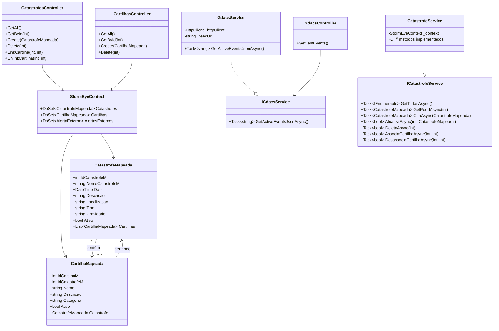

# StormEye 🌪️🛰️

API RESTful para monitoramento e gerenciamento de eventos relacionados a catástrofes naturais e cartilhas de sobrevivência, desenvolvida com **.NET 9** e **Entity Framework Core**, utilizando banco de dados Oracle.

---

## ✅ Funcionalidades

- CRUD de Catástrofes  
- CRUD de Cartilhas  
- GET  de Alertas Externos  (GDAC)
- Documentação automática da API via OpenAPI (Swagger)  

---

## 📌 Endpoints Principais

### 🌪️ Catástrofes

- `GET /api/catastrofes` — Lista todas as catástrofes  
- `GET /api/catastrofes/{id}` — Detalha uma catástrofe  
- `POST /api/catastrofes` — Cria uma nova catástrofe  
- `DELETE /api/catastrofes/{id}` — Remove uma catástrofe  
- `POST /api/catastrofes/{catId}/cartilhas/{cartId}` — Associa uma cartilha  
- `DELETE /api/catastrofes/{catId}/cartilhas/{cartId}` — Desassocia uma cartilha  

### 📚 Cartilhas

- `GET /api/cartilhas` — Lista todas as cartilhas  
- `GET /api/cartilhas/{id}` — Detalha uma cartilha  
- `POST /api/cartilhas` — Cria uma nova cartilha  
- `DELETE /api/cartilhas/{id}` — Remove uma cartilha  

### 🔔 Alertas Externos (GDACS)

- `GET /api/gdacs/last` — Retorna os alertas ativos mais recentes  
---

## 📖 Documentação da API - Swagger (OpenAPI)

- Acesse `/swagger` após executar a aplicação  
- Interface interativa para testar endpoints  
- Visualização de modelos, parâmetros e respostas  

---

## 🗂️ Estrutura do Projeto

- `StormEye.Domain`: Entidades de domínio  
- `StormEye.Infrastructure`: EF Core, Migrations e Contexto  
- `StormEyeApi`: Controllers, configuração e Swagger  
- `StormEyeWeb`: Front-end Razor 
---

## 🚀 Como Executar

### Pré-requisitos

- .NET 9 SDK  
- Banco de dados Oracle  
- Git

### Passos

```bash
git clone https://github.com/AdonayRocha/StormEye.git
cd StormEye
```

```bash
cd StormEyeApi
dotnet ef database update --project ../StormEye.Infrastructure/StormEye.Infrastructure.csproj --startup-project .
dotnet run
```

Acesse no navegador: [https://localhost:7137/swagger](https://localhost:7137/swagger)

---
Diagram Model





---

## 🛠 Tecnologias Utilizadas

- .NET 9 / ASP.NET Core  
- Entity Framework Core  
- Oracle Database  
- Swagger / Swashbuckle  
- C# 9  
- Razor Pages 
- JavaScript / CSS  

---

## 📄 Licença

Este projeto está sob a [MIT License](LICENSE).
