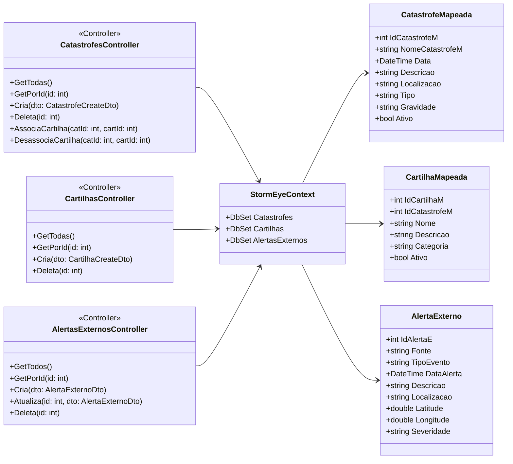

# StormEye

## Índice

- [Sobre o Projeto](#sobre-o-projeto)  
- [Funcionalidades](#funcionalidades)  
- [Arquitetura](#arquitetura)  
- [Diagrama de Classes](#diagrama-de-classes)  
- [Tecnologias Utilizadas](#tecnologias-utilizadas)  
- [Como Executar](#como-executar)  
  - [Pré-requisitos](#pré-requisitos)  
  - [Clonando o Repositório](#clonando-o-repositório)  
  - [Configuração](#configuração)  
  - [Executando a API](#executando-a-api)  
  - [Executando o Front-end](#executando-o-front-end)  
- [Endpoints da API](#endpoints-da-api)  
  - [Catástrofes](#catástrofes)  
  - [Cartilhas](#cartilhas)  
  - [Alertas Externos](#alertas-externos)  
- [Como Testar](#como-testar)  
- [Contribuição](#contribuição)  
- [Licença](#licença)  
- [Contato](#contato)  

---

## Sobre o Projeto

O **StormEye** é um sistema de monitoramento e gerenciamento de catástrofes naturais. Ele reúne informações sobre eventos extremos (como tempestades, terremotos, inundações etc.), disponibiliza cartilhas de prevenção. A aplicação é dividida em três camadas principais:

1. **StormEye.Domain**: Contém as entidades que representam o modelo de domínio (Catástrofe, Cartilha, Alerta Externo).  
2. **StormEye.Infrastructure**: Responsável pela persistência (Entity Framework Core).  
3. **StormEyeApi**: Exposta como uma API RESTful em ASP.NET Core, agrupa os controllers que lidam com Catástrofes, Cartilhas e Alertas Externos.  
4. **StormEyeWeb**: Projeto front-end (ASP.NET MVC ou SPA) que consome a API e apresenta uma interface para o usuário final.

O objetivo principal é oferecer uma visão consolidada de catástrofes em tempo real, além de materiais educativos (cartilhas) e alertas periódicos automatizados.

---

## Funcionalidades

- CRUD completo de **Catástrofes** (nome, data, descrição, localização, tipo, gravidade, ativo).  
- CRUD completo de **Cartilhas** (associação a Catástrofe, nome, descrição, categoria, ativo).  
- Associações entre Catástrofes e Cartilhas (vinculação e desvinculação).  
- Interface web responsiva para consulta de catástrofes, leitura de cartilhas e visualização de alertas.  
- Contexto EF Core configurado para Oracle (ou outro provedor configurável).  
- Documentação de API com Swagger.

---

## Arquitetura

```
StormEye.sln
│
├─ StormEye.Domain
│    ├─ Entities:
│    │    ├─ CatastrofeMapeada.cs
│    │    ├─ CartilhaMapeada.cs
│    │    └─ AlertaExterno.cs
│    └─ (Outros agregados de domínio)
│
├─ StormEye.Infrastructure
│    ├─ Data:
│    │    └─ StormEyeContext.cs         ← DbContext configurado
│    ├─ Migrations/                     ← Migrations do EF Core
│    └─ (Repositórios, configurações de conexão)
│
├─ StormEyeApi
│    ├─ Controllers:
│    │    ├─ CatastrofesController.cs   ← CRUD e associações de catástrofes
│    │    ├─ CartilhasController.cs     ← CRUD de cartilhas
│    │    └─ AlertasExternosController.cs ← CRUD de alertas externos
│    ├─ Program.cs                      ← Configuração de serviços, EF Core, CORS etc.
│    ├─ appsettings.json                ← Strings de conexão, logging
│    └─ launchSettings.json             ← Configuração de URLs locais
│
└─ StormEyeWeb
     ├─ Pages/ (Razor Pages que consomem a API)
     ├─ wwwroot/ (JS, CSS, HTML)
     └─ Program.cs (configuração do HttpClient, Razor Pages)
```

---

## Diagrama de Classes



---

## Tecnologias Utilizadas

- **.NET 9 / ASP.NET Core**  
- **Entity Framework Core** (Oracle provider configurável)  
- **Oracle Database** (ou outro banco suportado via EF Core)  
- **C# 11**  
- **Swagger / Swashbuckle** (documentação e testes da API)  
- **Razor Pages / MVC** (no projeto StormEyeWeb)  
- **JavaScript / CSS** (para front-end responsivo)  

---

## Como Executar

### Pré-requisitos

1. [.NET 9 SDK](https://dotnet.microsoft.com/pt-br/download/dotnet/9.0)  
2. [Oracle Database](https://www.oracle.com/database/) ou outro banco compatível  
3. [Git](https://git-scm.com/downloads)  

### Clonando o Repositório

```bash
git clone https://github.com/AdonayRocha/StormEye.git
cd StormEye
```

### Configuração

1. No arquivo `appsettings.json` (em **StormEyeApi**), ajuste a string de conexão Oracle:
   ```jsonc
   {
     "ConnectionStrings": {
       "OracleDb": "User Id=seu_usuario;Password=sua_senha;Data Source=oracle.host:1521/ORCL"
     },
     "Logging": {
       "LogLevel": {
         "Default": "Information",
         "Microsoft.AspNetCore": "Warning"
       }
     },
     "AllowedHosts": "*"
   }
   ```
2. Verifique o arquivo `launchSettings.json` (em **StormEyeApi/Properties**) para as portas locais (p.ex., `https://localhost:7137;http://localhost:5163`).

### Executando a API

1. Abra um terminal na pasta **StormEyeApi**:
   ```bash
   cd StormEyeApi
   ```
2. Aplique as Migrations via EF Core:
   ```bash
   dotnet ef database update --project ../StormEye.Infrastructure/StormEye.Infrastructure.csproj --startup-project .
   ```
3. Execute a API:
   ```bash
   dotnet run
   ```
4. Verifique no terminal:
   ```
   Now listening on: https://localhost:7137
   Now listening on: http://localhost:5163
   ```
5. Abra no navegador: `https://localhost:7137/swagger` para acessar a documentação e testar endpoints.

### Executando o Front-end

1. Abra um novo terminal na pasta **StormEyeWeb**:
   ```bash
   cd ../StormEyeWeb
   ```
2. Certifique-se de que o `Program.cs` do StormEyeWeb aponta o HttpClient para `https://localhost:7137/`.
3. Execute o front-end:
   ```bash
   dotnet run
   ```
4. O site ficará disponível em `https://localhost:7145` (ou porta configurada). Navegue para visualizar catástrofes e cartilhas.

---

## Endpoints da API

> **Observação:** ajuste a porta conforme configuração local.  

### Catástrofes

- **GET** `/api/catastrofes`  
  - **O que faz**: retorna todas as catástrofes cadastradas.  
  - **Como testar via Swagger**:  
    1. Acesse `https://localhost:7137/swagger`.  
    2. Expanda **GET /api/Catastrofes**, clique em “Try it out” e em “Execute”.  
  - **Como testar via curl**:  
    ```bash
    curl -X GET "https://localhost:7137/api/catastrofes"
    ```

- **GET** `/api/catastrofes/{id}`  
  - **O que faz**: retorna a catástrofe com `idCatastrofeM = {id}`.  
  - **Como testar via Swagger**:  
    1. Expanda **GET /api/Catastrofes/{id}**.  
    2. Clique em “Try it out”, informe `id` (ex.: `1`), clique em “Execute”.  
  - **Como testar via curl**:  
    ```bash
    curl -X GET "https://localhost:7137/api/catastrofes/1"
    ```

- **POST** `/api/catastrofes`  
  - **O que faz**: cria uma nova catástrofe.  
  - **Body (JSON)**:
    ```json
    {
      "nomeCatastrofeM": "Tempestade Tropical",
      "data": "2025-06-01T14:30:00",
      "descricao": "Forte tempestade com ventos acima de 120 km/h.",
      "localizacao": "Costa Leste",
      "tipo": "Tempestade",
      "gravidade": "Alta",
      "ativo": true
    }
    ```
  - **Como testar via Swagger**:  
    1. Expanda **POST /api/Catastrofes**.  
    2. Clique em “Try it out”.  
    3. Selecione **application/json** no dropdown.  
    4. Cole o JSON acima e clique em “Execute”.  
  - **Como testar via curl**:  
    ```bash
    curl -X POST "https://localhost:7137/api/catastrofes"          -H "Content-Type: application/json"          -d '{
               "nomeCatastrofeM":"Tempestade Tropical",
               "data":"2025-06-01T14:30:00",
               "descricao":"Forte tempestade com ventos acima de 120 km/h.",
               "localizacao":"Costa Leste",
               "tipo":"Tempestade",
               "gravidade":"Alta",
               "ativo": true
             }'
    ```

- **DELETE** `/api/catastrofes/{id}`  
  - **O que faz**: deleta a catástrofe com `idCatastrofeM = {id}`.  
  - **Como testar via Swagger**:  
    1. Expanda **DELETE /api/Catastrofes/{id}**.  
    2. Clique em “Try it out”, informe `id` e clique em “Execute”.  
  - **Como testar via curl**:  
    ```bash
    curl -X DELETE "https://localhost:7137/api/catastrofes/1"
    ```

- **POST** `/api/catastrofes/{catId}/cartilhas/{cartId}`  
  - **O que faz**: associa a cartilha de id `{cartId}` à catástrofe `{catId}`.  
  - **Como testar via Swagger**:  
    1. Expanda **POST /api/Catastrofes/{catId}/cartilhas/{cartId}**.  
    2. Clique em “Try it out”, informe `catId` (ex.: `1`) e `cartId` (ex.: `5`), clique em “Execute”.  
  - **Como testar via curl**:  
    ```bash
    curl -X POST "https://localhost:7137/api/catastrofes/1/cartilhas/5"
    ```

- **DELETE** `/api/catastrofes/{catId}/cartilhas/{cartId}`  
  - **O que faz**: desassocia a cartilha `{cartId}` da catástrofe `{catId}`.  
  - **Como testar via Swagger**:  
    1. Expanda **DELETE /api/Catastrofes/{catId}/cartilhas/{cartId}**.  
    2. Clique em “Try it out”, informe `catId` e `cartId`, clique em “Execute”.  
  - **Como testar via curl**:  
    ```bash
    curl -X DELETE "https://localhost:7137/api/catastrofes/1/cartilhas/5"
    ```

### Cartilhas

- **GET** `/api/cartilhas`  
  - **O que faz**: retorna todas as cartilhas cadastradas.  
  - **Como testar via Swagger**:  
    1. Expanda **GET /api/Cartilhas**.  
    2. Clique em “Try it out” e “Execute”.  
  - **Como testar via curl**:  
    ```bash
    curl -X GET "https://localhost:7137/api/cartilhas"
    ```

- **GET** `/api/cartilhas/{id}`  
  - **O que faz**: retorna a cartilha com `idCartilhaM = {id}`.  
  - **Como testar via Swagger**:  
    1. Expanda **GET /api/Cartilhas/{id}**.  
    2. Clique em “Try it out”, informe `id` (ex.: `5`), clique em “Execute”.  
  - **Como testar via curl**:  
    ```bash
    curl -X GET "https://localhost:7137/api/cartilhas/5"
    ```

- **POST** `/api/cartilhas`  
  - **O que faz**: cria uma nova cartilha associada a uma catástrofe.  
  - **Body (JSON)**:
    ```json
    {
      "idCatastrofeM": 1,
      "nome": "Guia de Sobrevivência",
      "descricao": "Como se preparar para tempestades",
      "categoria": "Prevenção",
      "ativo": true
    }
    ```
  - **Como testar via Swagger**:  
    1. Expanda **POST /api/Cartilhas**.  
    2. Clique em “Try it out”.  
    3. Selecione **application/json**.  
    4. Cole o JSON acima e clique em “Execute”.  
  - **Como testar via curl**:  
    ```bash
    curl -X POST "https://localhost:7137/api/cartilhas"          -H "Content-Type: application/json"          -d '{
               "idCatastrofeM": 1,
               "nome":"Guia de Sobrevivência",
               "descricao":"Como se preparar para tempestades",
               "categoria":"Prevenção",
               "ativo": true
             }'
    ```

- **DELETE** `/api/cartilhas/{id}`  
  - **O que faz**: deleta a cartilha com `idCartilhaM = {id}`.  
  - **Como testar via Swagger**:  
    1. Expanda **DELETE /api/Cartilhas/{id}**.  
    2. Clique em “Try it out”, informe `id` e clique em “Execute”.  
  - **Como testar via curl**:  
    ```bash
    curl -X DELETE "https://localhost:7137/api/cartilhas/5"
    ```

### Alertas Externos (opcional, se implementados)

- **GET** `/api/alertasExternos`  
  - **O que faz**: retorna todos os alertas externos cadastrados.  
  - **Como testar via Swagger**:  
    1. Expanda **GET /api/AlertasExternos**.  
    2. Clique em “Try it out” e “Execute”.  
  - **Como testar via curl**:
    ```bash
    curl -X GET "https://localhost:7137/api/alertasExternos"
    ```

- **GET** `/api/alertasExternos/{id}`  
  - **O que faz**: retorna o alerta externo com `idAlertaE = {id}`.  
  - **Como testar via Swagger**:  
    1. Expanda **GET /api/AlertasExternos/{id}**.  
    2. Clique em “Try it out”, informe `id` e clique em “Execute”.  
  - **Como testar via curl**:
    ```bash
    curl -X GET "https://localhost:7137/api/alertasExternos/1"
    ```

- **POST** `/api/alertasExternos`  
  - **O que faz**: cria um novo alerta externo.  
  - **Body (JSON)** (exemplo):
    ```json
    {
      "fonte": "GDACS",
      "tipoEvento": "Furacão",
      "dataAlerta": "2025-06-05T12:00:00",
      "descricao": "Furacão categoria 4 se aproximando da costa.",
      "localizacao": "Costa Oeste",
      "latitude": -23.5505,
      "longitude": -46.6333,
      "severidade": "Alta"
    }
    ```
  - **Como testar via Swagger**:  
    1. Expanda **POST /api/AlertasExternos**.  
    2. Clique em “Try it out”.  
    3. Selecione **application/json**.  
    4. Cole o JSON acima e clique em “Execute”.  
  - **Como testar via curl**:
    ```bash
    curl -X POST "https://localhost:7137/api/alertasExternos"          -H "Content-Type: application/json"          -d '{
               "fonte":"GDACS",
               "tipoEvento":"Furacão",
               "dataAlerta":"2025-06-05T12:00:00",
               "descricao":"Furacão categoria 4 se aproximando da costa.",
               "localizacao":"Costa Oeste",
               "latitude": -23.5505,
               "longitude": -46.6333,
               "severidade":"Alta"
             }'
    ```

- **PUT** `/api/alertasExternos/{id}`  
  - **O que faz**: atualiza o alerta externo com `idAlertaE = {id}`.  
  - **Body (JSON)**: mesclagem das mesmas propriedades do POST.  
  - **Como testar via Swagger**:  
    1. Expanda **PUT /api/AlertasExternos/{id}**.  
    2. Clique em “Try it out”, informe `id` e cole o JSON, depois “Execute”.  
  - **Como testar via curl**:
    ```bash
    curl -X PUT "https://localhost:7137/api/alertasExternos/1"          -H "Content-Type: application/json"          -d '{
               "fonte":"GDACS",
               "tipoEvento":"Furacão",
               "dataAlerta":"2025-06-05T14:00:00",
               "descricao":"Atualização: Categoria 5.",
               "localizacao":"Costa Oeste",
               "latitude": -23.5505,
               "longitude": -46.6333,
               "severidade":"Máxima"
             }'
    ```

- **DELETE** `/api/alertasExternos/{id}`  
  - **O que faz**: deleta o alerta externo com `idAlertaE = {id}`.  
  - **Como testar via Swagger**:  
    1. Expanda **DELETE /api/AlertasExternos/{id}**.  
    2. Clique em “Try it out”, informe `id` e clique em “Execute”.  
  - **Como testar via curl**:
    ```bash
    curl -X DELETE "https://localhost:7137/api/alertasExternos/1"
    ```

---

## Como Testar

1. **Usando Swagger**  
   - Rode a API (`dotnet run` em StormEyeApi).  
   - Acesse no navegador: `https://localhost:7137/swagger`.  
   - Para cada endpoint listado, clique em "Try it out", selecione o método, preencha parâmetros ou corpo JSON, e clique em "Execute".  
   - Veja a resposta na seção "Responses".

2. **Usando curl via linha de comando**  
   - Exemplo para listar catástrofes:
     ```bash
     curl -X GET "https://localhost:7137/api/catastrofes"
     ```
   - Exemplo para criar catástrofe:
     ```bash
     curl -X POST "https://localhost:7137/api/catastrofes"           -H "Content-Type: application/json"           -d '{
                "nomeCatastrofeM":"Tempestade Tropical",
                "data":"2025-06-01T14:30:00",
                "descricao":"Forte tempestade com ventos acima de 120 km/h.",
                "localizacao":"Costa Leste",
                "tipo":"Tempestade",
                "gravidade":"Alta",
                "ativo": true
              }'
     ```
   - Ajuste a URL e os campos conforme o endpoint que deseja testar.

3. **Usando Postman (ou outra ferramenta de API)**  
   - Crie uma nova requisição e selecione o método (GET, POST, etc.).  
   - Informe a URL completa (`https://localhost:7137/api/...`).  
   - Se for POST/PUT, vá em “Body”, selecione “raw” e “JSON”, cole o JSON de exemplo.  
   - Envie a requisição e verifique a resposta.

---

## Licença

Este projeto está licenciado sob a [MIT License](https://opensource.org/licenses/MIT). Consulte o arquivo `LICENSE` para mais detalhes.
